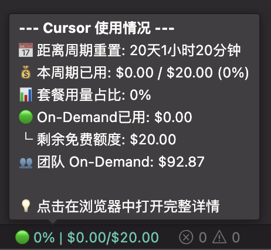

# Cursor Cost Info


一个 VS Code / Cursor 扩展，**在状态栏实时显示 Cursor API 使用额度**，让你对 AI 代码助手的消耗了如指掌。**零配置**自动读取登录凭据，开箱即用！

## 为什么选择 Cursor Cost Info？

- **🙈 告别糊里糊涂**：每次 AI 代码生成都花了多少钱？状态栏一眼看清
- **💰 预算可控**：套餐即将用完？红色预警提醒，再也不怕意外超额
- **⚡ 懒人必备**：**无需任何配置**，安装即用，自动读取登录信息
- **🔄 智能刷新**：窗口失焦自动暂停省电，聚焦立即刷新最新数据



## 功能特性

### 🚀 核心功能
- **零配置自动认证**：自动从 Cursor 本地 SQLite 数据库读取 accessToken，无需手动配置 Cookie
- **备用浏览器认证**：本地 Token 不可用时，自动从 Chrome/Firefox/Safari 读取 Cookie
- **状态栏实时显示**：左侧状态栏展示当前使用额度（美元格式）
- **彩色小球指示器**：🟢🟡🟠🔴 颜色随使用率变化，直观醒目

### 💡 智能预警
- **无限额套餐支持**：自动识别无限额订阅，仅显示已用金额
- **On-Demand 分级预警**：
  - 🔴 **超额警告**：已超出公司限额，红色醒目提示
  - 🟡 **黄色预警**：剩余免费额度不足 20%
  - 🟢 **正常显示**：显示已用金额及剩余额度
- **计费周期倒计时**：悬浮提示显示距离周期重置的剩余时间

### 📊 详细用量
- **套餐用量占比**：展示来自 API 的套餐用量百分比
- **团队用量支持**：展示个人用量与团队 On-Demand 用量
- **最近使用记录**：悬浮提示显示最近 10 条使用详情（时间、类型、模型、Token、花费）

### ⚙️ 智能体验
- **窗口焦点管理**：窗口失焦自动暂停轮询省电，聚焦立即刷新
- **自动重载机制**：支持外部脚本触发插件热更新
- **定时刷新**：默认每 30 秒自动刷新
- **快速跳转**：点击状态栏直接在浏览器打开 Cursor Dashboard
- **手动刷新**：命令面板一键刷新

### 🌐 跨平台支持
- ✅ macOS
- ✅ Linux
- ✅ Windows

## 安装效果

**有限额套餐：**
```
🟡 65% | $1.03/$20.00
```

**无限额套餐：**
```
🟢 已用: $1.03
```

**超额警告：**
```
🔴 $25.00 | 超出 $5.00
```

## 悬浮提示详情

鼠标悬浮在状态栏项上，可以看到详细的使用统计：

- **📅 计费周期倒计时**：距离周期重置剩余 X 天 X 小时 X 分钟
- **💰 本周期已用**：总已用金额、总限额、使用百分比
- **📊 套餐用量占比**：来自 API 的套餐配额百分比
- **🔔 On-Demand 用量**：
  - 超额：红色显示超出金额
  - 预警：黄色显示剩余额度不足 20%
  - 正常：绿色显示剩余额度
- **👥 团队用量**：团队按需用量
- **📝 最近使用记录**：最近 10 条使用事件明细

## 使用方法

### 自动使用（推荐）

插件激活后自动显示额度信息，无需任何配置！

### 手动刷新

1. 按 `Cmd+Shift+P`（Mac）或 `Ctrl+Shift+P`（Windows/Linux）
2. 输入 `Refresh Cursor Cost Info`
3. 回车执行

### 查看详情

点击状态栏上的额度信息，直接在浏览器中打开 [Cursor Dashboard](https://cursor.com/cn/dashboard?tab=usage)。

### 配置公司限额（可选）

如需自定义公司 On-Demand 限额，可在 VSCode 设置中添加：

```json
{
  "cursorCostInfo.companyOnDemandLimit": 20
}
```

默认值 $20，超出部分员工自费。

## 数据说明

插件显示的数据来自 Cursor 官方 API：

- **已用金额** = 计划使用（plan breakdown total）+ 按需使用（onDemand.used）
- **总限额** = 计划限额（plan.limit）+ 按需限额（onDemand.limit）
- **百分比** = (已用金额 / 总限额) × 100%
- 所有金额以美元格式显示（$XX.XX），原始数据以美分为单位

## 颜色指示说明

| 颜色 | 百分比 | 含义 |
|------|--------|------|
| 🟢 绿色 | 0-50% | 使用率低，额度充裕 |
| 🟡 黄色 | 50-80% | 使用率中等，需关注 |
| 🟠 橙色 | 80-90% | 使用率较高，接近限额 |
| 🔴 红色 | 90-100%+ | 使用率很高，已超限额 |

## 故障排除

### 显示"未找到认证信息"

- 确保已登录 Cursor IDE
- 确保系统已安装 `sqlite3` 命令行工具
- 检查 Cursor 的 `state.vscdb` 文件是否存在

### 显示"获取失败"

- 检查网络连接是否正常
- Token 可能已过期，重新登录 Cursor 即可自动刷新
- 点击状态栏可立即重试
- 查看 VS Code 开发者控制台（Help > Toggle Developer Tools）查看详细错误

### Token 过期

Cursor 的 accessToken 会定期过期。遇到认证失败（401）时，重新登录 Cursor IDE，插件会自动读取新 Token。

## 命令列表

| 命令 | 说明 |
|------|------|
| `Show Cursor Cost Details` | 在浏览器中打开 Cursor Dashboard |
| `Refresh Cursor Cost Info` | 手动刷新额度信息 |

## 项目结构

```
src/
├── extension.ts    # 扩展入口，状态栏、悬浮提示、定时刷新、窗口焦点管理
├── api.ts         # API 调用、数据类型、格式化工具
├── auth.ts        # Token 读取、JWT 解析、user_id 提取
└── config.ts      # 认证解析、浏览器 Cookie 读取
```

## API 接口

插件根据认证方式自动选择对应的 API 端点：

| 认证方式 | API 端点 | 方法 | 用途 |
|----------|----------|------|------|
| Token | `https://api2.cursor.sh/auth/usage-summary` | GET | 获取使用摘要 |
| Cookie | `https://cursor.com/api/usage-summary` | GET | 获取使用摘要 |
| Token/Cookie | `https://cursor.com/api/dashboard/get-filtered-usage-events` | POST | 获取使用事件列表 |

## 隐私说明

- 本插件**仅在本地**读取 Cursor IDE 的登录信息
- 仅向 Cursor 官方 API 发送请求
- **不会收集、存储或传输**任何用户数据到第三方
- Token 信息仅从本地数据库读取，**不会上传**
- 所有数据仅在本地处理和显示

## 许可证

MIT License

## 贡献

欢迎提交 Issue 和 Pull Request！

项目地址：[https://github.com/ke112/cursor-cost-info](https://github.com/ke112/cursor-cost-info)

## 免责声明

本插件为非官方工具，仅供个人使用。请遵守 Cursor 的服务条款。
